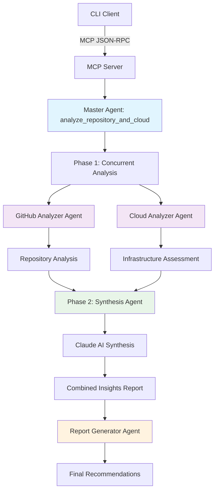

# Scale Advisor MCP Server Demo

## CLI Demo - Direct MCP Interaction

### Setup
```bash
export CLAUDE_API_KEY=your_claude_key
export GITHUB_TOKEN=your_github_token
npm run build
```

### Start Interactive CLI
```bash
node cli-client.js
```

## Demo Workflow

The CLI will start the MCP server in STDIO mode and provide an interactive menu:

### Step 1: Comprehensive Analysis
- Select option `1` or type `comprehensive`
- **Action**: Runs master agent with multi-agent workflow
- **Output**: Complete analysis report with security, scalability, and performance insights

### Step 2: Generate Infrastructure
- Select option `2` or type `infra`  
- **Action**: Infrastructure generation agent analyzes cloud resource requirements and generates Terraform
- **Output**: 7 Terraform files created in `infra-gen/` (VPC, EC2, RDS, Security Groups)

### Step 3: Create GitHub PR
- Select option `3` or type `pr`
- **Action**: Creates GitHub PR with infrastructure files
- **Output**: Live PR URL and success confirmation

## Multi-Agent Orchestration Workflow



### Agent Flow Details:

**Phase 1: Concurrent Analysis** (30-45s)
- 🔍 **GitHub Analyzer**: Repository structure, dependencies, tech stack
- ☁️ **Cloud Analyzer**: Infrastructure patterns, scaling recommendations

**Phase 2: Synthesis** (15-20s)  
- 🧠 **Synthesis Agent**: Combines GitHub + Cloud insights via Claude AI
- 📊 **Report Generator**: Creates structured recommendations

## Master Agent Workflow

The `analyze_repository_and_cloud` tool orchestrates multiple agents:
1. **GitHub Analyzer Agent** - Repository architecture analysis
2. **Cloud Analyzer Agent** - AWS resource analysis  
3. **Synthesis Agent** - Combines all analyses
4. **Report Generator** - Creates executive summary, technical details, and recommendations

## Expected Results

- **Step 1**: Comprehensive scaling report with multi-agent insights
- **Step 2**: Production-ready Terraform infrastructure code
- **Step 3**: GitHub PR with infrastructure ready for deployment
